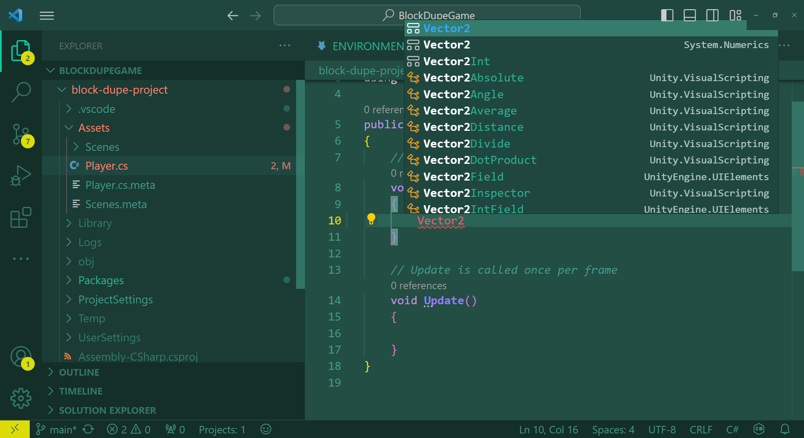

# SETTING UP YOUR ENVIRONMENT
Unity Version: 2022.3.9f1
.NET Version: 7.0.10

## Steps (Windows)
0. Download Github Desktop for easy git usage as an application (or don't and just download git)

1. Download Unity Hub and download Unity 2022.3.9f1 from the Unity Hub.

2. Clone the repository into any folder of your choosing.

3. Using Unity Hub, add the "block-dupe-project" directory as a Unity project.

4. Add the following extensions to VSCode, or find similar extensions that allow Code Completion:
    - Unity Extension
    - C# Extension

5. If Visual Studio Code pesters you about not having .NET, install that with the link they provide. (should be .NET Version 7.0.10)
    - if you install .NET and try 'dotnet 'in the terminal and it **doesn't** work right after installing, you should **reset your computer** so it updates the Windows path.

6. Open the 'block-dupe-project' in Unity Hub.

7. If it works correctly, you should be able to open a script file, open the main repository folder and edit it in VSCode with IntelliSense.
    - Unity types like 'Vector2' and 'Vector3' should be able to be autocompleted.

If not, contact Ryan Trozzolo via Canvas or email so I can help you get set up.

## I think everyone in this group uses Windows, right?